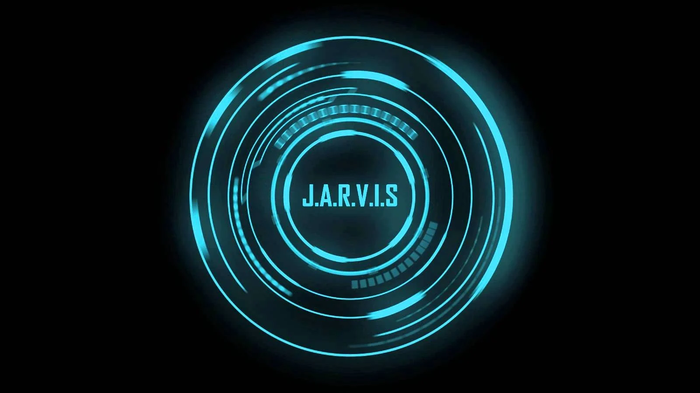

# Jarvis 2.0

Jarvis 2.0 é um assistente virtual pessoal desenvolvido em Python, com interface gráfica moderna e comandos de voz em português. Inspirado no assistente do universo Marvel, o objetivo do projeto é facilitar a automação de tarefas diárias no computador, integrando reconhecimento de voz, automação desktop e acesso rápido a informações e aplicativos.



---

## Principais Funcionalidades

- **Comandos de voz em português:** Interaja com o assistente usando sua voz para executar tarefas.
- **Interface gráfica futurista:** Desenvolvida em PyQt6, com animações, status e feedback visual.
- **Automação de desktop:** Abra sites e aplicativos, controle o volume, digite textos automaticamente, toque músicas no YouTube, pesquise na web, obtenha informações do sistema, verifique a velocidade da internet, entre outros.
- **Rotinas inteligentes:** Comandos como "iniciar dia" e "finalizar dia" para abrir/fechar e organizar os aplicativos do seu fluxo de trabalho.
- **Respostas em áudio:** O Jarvis responde a todos os comandos com voz sintetizada.

---

## Demonstração

> **IEm Breve**

---

## Instalação

### Pré-requisitos

- Python 3.9+
- Sistema operacional **Windows** (maior parte das automações são otimizadas para Windows)
- [Git](https://git-scm.com/) instalado

### Passos

1. Clone o repositório:
   ```bash
   git clone https://github.com/dclaumanndeveloper/Jarvis2.0.git
   cd Jarvis2.0


## Avisos e Limitações

- **Compatibilidade:** O projeto foi desenvolvido para Windows. Algumas automações podem não funcionar em outros sistemas operacionais sem adaptação.
- **Segurança:** Cuidado ao usar comandos que executam programas externos ou manipulam o sistema.
- **Dependências:** Algumas bibliotecas exigem permissões extras ou instalação de softwares auxiliares.

---

## Licença

Este projeto está sob a licença MIT. Veja o arquivo [LICENSE](LICENSE) para mais detalhes.

---

## Autor

Desenvolvido por [dclaumanndeveloper](https://github.com/dclaumanndeveloper)
